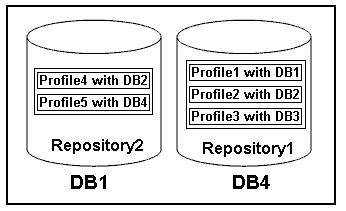

= プロファイルとは
:allow-uri-read: 
:icons: font
:imagesdir: ../media/

[role="lead"]
SnapManager はプロファイルを使用して、特定のデータベースに対して処理を実行するために必要な情報を格納します。プロファイルには、クレデンシャル、バックアップ、クローンなど、データベースに関する情報が格納されます。プロファイルを作成すると、そのデータベースに対して処理を実行するたびにデータベースの詳細を指定する必要がなくなります。

1 つのプロファイルが参照できるデータベースは 1 つだけです。同じデータベースは、複数のプロファイルから参照できます。両方のプロファイルが同じデータベースを参照している場合でも、 1 つのプロファイルを使用して作成したバックアップには、別のプロファイルからアクセスすることはできません。

プロファイル情報は、リポジトリに保存されます。リポジトリには、データベースのプロファイル情報と、データベースのバックアップに使用する Snapshot コピーの情報の両方が含まれます。実際の Snapshot コピーはストレージシステム上に格納されます。Snapshot コピー名は、そのデータベースのプロファイルが含まれているリポジトリに保存されます。データベースに対して処理を実行する場合は、リポジトリからプロファイルを選択する必要があります。

次の図に、リポジトリに複数のプロファイルを保持する方法を示します。また、各プロファイルで定義できるデータベースは 1 つだけです。

この例では、 Repository2 がデータベース DB1 に、 Repository1 が DB4 に格納されています。

各プロファイルには、そのプロファイルに関連付けられたデータベースのクレデンシャルが含まれます。クレデンシャルを使用して、 SnapManager がデータベースに接続して操作できるようになります。格納されるクレデンシャルには、ホスト、リポジトリ、データベースにアクセスするためのユーザ名とパスワードのペア、および Oracle Recovery Manager （ RMAN ）を使用する場合の必要な接続情報が含まれます。

2 つのプロファイルが同じデータベースに関連付けられていても、あるプロファイルを使用して作成されたバックアップには、別のプロファイルからアクセスすることはできません。SnapManager はデータベースをロックし、矛盾する 2 つの処理が同時に実行されないようにします。

* フル・バックアップおよびパーシャル・バックアップの作成プロファイル *

プロファイルを作成して、フル・バックアップまたはパーシャル・バックアップを作成できます。

フル・バックアップおよびパーシャル・バックアップを作成するように指定したプロファイルには、データ・ファイルとアーカイブ・ログ・ファイルの両方が含まれます。SnapManager では、このようなプロファイルを使用して、アーカイブ・ログ・バックアップをデータ・ファイル・バックアップから分離することはできません。フルバックアップとパーシャルバックアップは既存のバックアップ保持ポリシーに基づいて保持され、既存の保護ポリシーに基づいて保護されます。バックアップのスケジュールは、時間と頻度に基づいて設定することができます。

* データ・ファイルのみのバックアップおよびアーカイブ・ログのみのバックアップを作成するためのプロファイル *

SnapManager （ 3.2 以降）では、アーカイブ・ログ・ファイルのバックアップを、データ・ファイルとは別に作成するプロファイルを作成できます。プロファイルを使用してバックアップ・タイプを指定すると、データベースのデータ・ファイルのみのバックアップまたはアーカイブ・ログのみのバックアップのいずれかを作成できます。データファイルとアーカイブログファイルの両方を含むバックアップを一緒に作成することもできます。

保持ポリシー：アーカイブログのバックアップが分離されていない場合は、すべてのデータベースバックアップを環境に保存します。アーカイブログバックアップを分けたあと、 SnapManager でアーカイブログバックアップに別の保持期間と保護ポリシーを指定できます。

* 保持ポリシー *

SnapManager は、保持数（ 15 個のバックアップなど）と保持期間（ 10 日分のバックアップなど）の両方を考慮して、バックアップを保持するかどうかを決定します。バックアップは、保持クラスに設定された保持期間を経過し、バックアップ数が保持数を超えると期限切れになります。たとえば、バックアップ数が 15 （ SnapManager で成功したバックアップが 15 回作成された）で、所要時間が日次バックアップの 10 日間に設定されている場合、所要時間は 5 つの古いバックアップ、成功したバックアップ、有効なバックアップの期限が切れます。

* ログの保存期間 * をアーカイブします

アーカイブログバックアップは、分離されたあと、アーカイブログの保持期間に基づいて保持されます。データファイルのバックアップとともに作成されたアーカイブログのバックアップは、アーカイブログの保持期間に関係なく、常にそのデータファイルのバックアップとともに保持されます。
